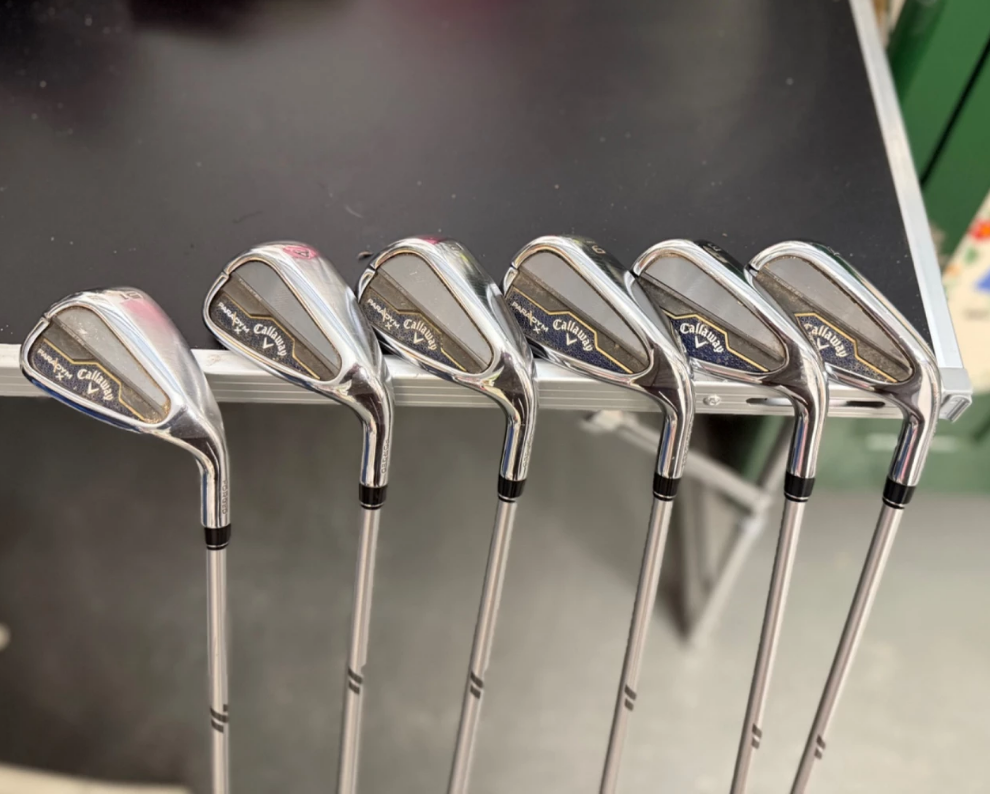
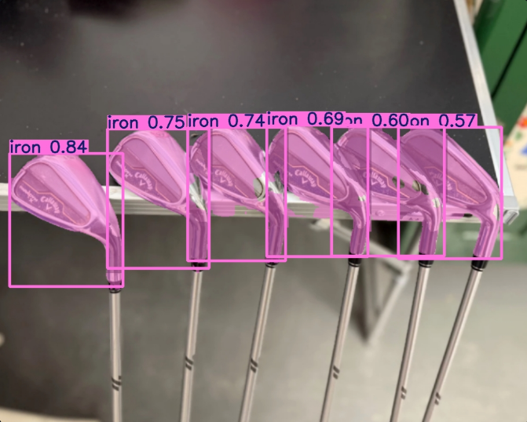

# Golf Equipment Detection App


## 📖 Overview

The **Golf Equipment Detection App** is a Streamlit-based web application designed to identify golf equipment in images, extract relevant text using Azure OCR, and predict the equipment's market price. It leverages a custom-trained **YOLOv11** model (`best.pt`) for object detection, Azure Cognitive Services for text extraction, and an XGBoost model for price prediction. The app supports detection of golf equipment categories such as drivers, fairway woods, hybrids, irons, wedges, putters, golf bags, and golf balls, with price predictions for select categories.

This project is ideal for golf enthusiasts, retailers, or developers interested in computer vision and price estimation for sports equipment.

---

## ✨ Features

- **Object Detection**: Uses a custom-trained YOLOv11 model to detect golf equipment in images with adjustable confidence thresholds.
- **Text Extraction**: Extracts text from images using Azure OCR to identify brands, condition, and manufacturing year.
- **Price Prediction**: Estimates equipment prices based on detected attributes (brand, type, condition, age) using a pre-trained XGBoost model.
- **Interactive UI**: Built with Streamlit for a user-friendly experience, including image upload, detection visualization, and manual input forms.
- **Automated and Manual Predictions**: Supports automatic price estimation from detected attributes and manual input for custom predictions.
- **Custom Dataset**: Trained on a custom dataset tailored for golf equipment, ensuring high detection accuracy for specific categories.

---

## 📸 Screenshots

| **Uploaded Image** | **Detected Equipment** |
|---------------------|-------------------------|
|  |  |

---

## 🛠️ Installation

### Prerequisites
- **Python**: 3.8 or higher
- **Azure Account**: Subscription key and endpoint for Azure Cognitive Services (Computer Vision)
- **Dependencies**: Listed in `requirements.txt`
- **Model Files**:
  - YOLOv11 model: `best.pt`
  - XGBoost model: `xgb_model.json`
  - Encoders: `ohe_encoder.pkl`, `ordinal_encoder.pkl`, `feature_columns.pkl`

### Steps
1. **Clone the Repository**:
   ```bash
   git clone https://github.com/your-username/golf-equipment-detection.git
   cd golf-equipment-detection
   ```

2. **Set Up a Virtual Environment**:
   ```bash
   python -m venv venv
   source venv/bin/activate  # On Windows: venv\Scripts\activate
   ```

3. **Install Dependencies**:
   ```bash
   pip install -r requirements.txt
   ```

4. **Download Model Files**:
   - Place `best.pt` in the project root or update `model_path` in `main.py`.
   - Place `xgb_model.json`, `ohe_encoder.pkl`, `ordinal_encoder.pkl`, and `feature_columns.pkl` in the specified paths or update `load_p_model()` in `main.py`.

5. **Configure Azure OCR**:
   - Obtain your Azure subscription key and endpoint from the Azure portal.
   - Input these in the app's sidebar or set as environment variables:
     ```bash
     export AZURE_SUBSCRIPTION_KEY="your_key"
     export AZURE_ENDPOINT="your_endpoint"
     ```

6. **Run the Application**:
   ```bash
   streamlit run main.py
   ```

---

## 🚀 Usage

1. **Launch the App**:
   - Run the app using the command above. It will open in your default browser (e.g., `http://localhost:8501`).

2. **Configure Settings**:
   - In the sidebar, adjust the **Confidence Threshold** for YOLOv11 detection (default: 0.5).
   - Enter your **Azure Subscription Key** and **Endpoint** for OCR functionality.

3. **Upload an Image**:
   - Upload a PNG, JPG, JPEG, WEBP, or BMP image of golf equipment.
   - The app displays the uploaded image and the detection results side by side.

4. **View Detection Results**:
   - Detected equipment is highlighted with bounding boxes and labels.
   - A summary shows detected items and their confidence scores.

5. **Text Extraction**:
   - Azure OCR extracts text, identifying brand, condition, and year if present.
   - Extracted text is displayed below the detection summary.

6. **Price Prediction**:
   - If brand, type, condition, and year are detected, the app automatically predicts the price.
   - Alternatively, use the manual form to input details and estimate the price.

---

## 🧠 Model Details

### YOLOv11 Object Detection
- **Model**: Custom-trained YOLOv11 (`best.pt`)
- **Classes**:
  - `driver`
  - `fairway_wood`
  - `golf_bag`
  - `golf_ball`
  - `hybrid`
  - `iron`
  - `putter`
  - `wedge`
- **Training**: Trained on a custom dataset of golf equipment images for high accuracy in category-specific detection.
- **Usage**: Detects equipment in images with a configurable confidence threshold.

### Azure OCR
- **Service**: Azure Cognitive Services (Computer Vision)
- **Function**: Extracts text to identify brands, condition, and manufacturing year.
- **Supported Brands**: Includes CALLAWAY, TAYLORMADE, TITLEIST, PING, and more (see `brands` in `main.py`).
- **Conditions**: Moyen, Bon, Très bon, Neuf, Excellent.

### XGBoost Price Prediction
- **Model**: Pre-trained XGBoost model (`xgb_model.json`)
- **Features**:
  - Brand (one-hot encoded)
  - Type (e.g., driver, hybride, fers)
  - Condition (ordinal encoded)
  - Age (current year - manufacturing year)
- **Output**: Predicted price in Moroccan Dirham (DH).
- **Supported Types**: bois, driver, serie, hybride, fers, putter, wedge.

---

## 📂 Project Structure

```
golf-equipment-detection/
├── main.py                    # Main Streamlit application
├── best.pt                    # YOLOv11 model
├── requirements.txt           # Python dependencies
├── screenshots/               # Screenshots for README
│   ├── uploaded_image.png
│   └── detected_image.png
├── Model/                     # Price prediction model files
│   ├── xgb_model.json
│   ├── ohe_encoder.pkl
│   ├── ordinal_encoder.pkl
│   └── feature_columns.pkl
```

---

## 📋 Requirements

Create a `requirements.txt` file with the following dependencies:

```text
streamlit>=1.38.0
ultralytics>=8.3.0
Pillow>=10.4.0
joblib>=1.4.2
xgboost>=2.1.0
numpy>=1.26.4
pandas>=2.2.2
azure-cognitiveservices-vision-computervision>=0.9.0
msrest>=0.7.1
opencv-python-headless>=4.10.0
scikit-learn>=1.5.2
```

Install using:
```bash
pip install -r requirements.txt
```

---

## ⚠️ Limitations

- **OCR Accuracy**: Azure OCR may miss text in low-quality or cluttered images.
- **Price Prediction**: Limited to supported equipment types (excludes golf bags and balls).
- **Model Paths**: Hardcoded file paths in `main.py` require manual updates if models are stored elsewhere.
- **Azure Dependency**: Requires a valid Azure subscription for OCR functionality.

---

## 🌟 Future Improvements

- Add support for price prediction of golf bags and golf balls.
- Implement dynamic model path configuration via environment variables.
- Enhance OCR accuracy with pre-processing techniques for low-quality images.
- Integrate additional detection models (e.g., DETR) for comparison.
- Deploy the app to a cloud platform like Heroku or Azure for public access.

---

## 🤝 Contributing

Contributions are welcome! To contribute:

1. Fork the repository.
2. Create a new branch (`git checkout -b feature/your-feature`).
3. Make your changes and commit (`git commit -m "Add your feature"`).
4. Push to the branch (`git push origin feature/your-feature`).
5. Open a Pull Request.

Please ensure your code follows PEP 8 standards and includes appropriate tests.

---

## 📜 License

This project is licensed under the MIT License. See the [LICENSE](LICENSE) file for details.

---

## 🙏 Acknowledgments

- **Ultralytics**: For the YOLOv11 framework.
- **Microsoft Azure**: For Cognitive Services (Computer Vision) OCR capabilities.
- **Streamlit**: For the intuitive web app framework.
- **XGBoost**: For robust price prediction modeling.

---

## 📬 Contact

For questions or feedback, please open an issue on the [GitHub repository](https://github.com/your-username/golf-equipment-detection) or contact the maintainer at [your-email@example.com].
